# AI Interview Prep Kit

[](https://github.com/LEKKALAGANESH/ai-interview-prep-kit/actions/workflows/ci.yml)


[](LICENSE)

Turn a job description and a company website into a personalised, requirement-traced interview preparation kit: categorised questions, flashcards, an N-day study plan, and practice tracking.

Built for the Trao Full-Stack Engineering Assessment.

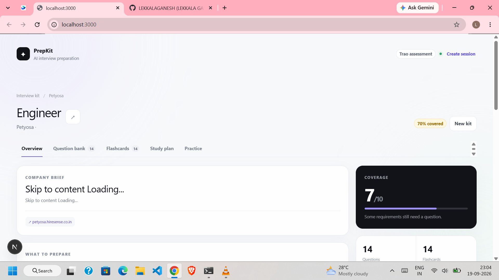

## Table of contents

- [Features](#features)
- [Screenshots](#screenshots)
- [Project structure](#project-structure)
- [Architecture](#architecture)
- [Getting started](#getting-started)
- [Deployment](#deployment)
- [API](#api)
- [Testing and evaluation](#testing-and-evaluation)
- [Documentation](#documentation)
- [Contributing](#contributing)
- [License](#license)

## Features

- **Structured JD extraction**: requirements with stable IDs, a `kind` (technical, behavioural, domain) and a `priority` (must, nice).
- **Company research**: secure page retrieval, link ranking and optional public interview research, all stored with provenance.
- **Requirement-traced questions**: every question points to one or more requirement IDs.
- **Deterministic coverage engine**: finds uncovered requirements and runs a bounded second pass to fill the gaps. The LLM never decides whether coverage exists.
- **Deterministic study plan**: exactly N days (1-60), 10 minutes per question.
- **Editable kit**: edit, add, delete, reorder, pin, move between days, and regenerate a single question. Pinned and edited content survives regeneration.
- **Flashcards and practice mode** with per-requirement practice coverage.
- **Multiple LLM providers**: Gemini, OpenAI, Anthropic Claude, Groq, and local Ollama.
- **Batch evaluation CLI** that keeps going when a single case fails.

## Screenshots

### Overview

Company brief, coverage score, role requirements with coverage status, and research provenance.

| | |
|---|---|
|  | 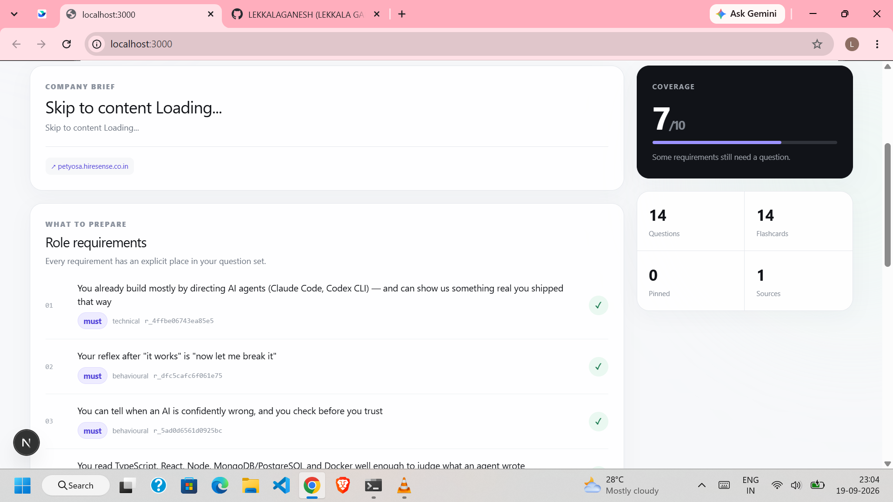 |
| 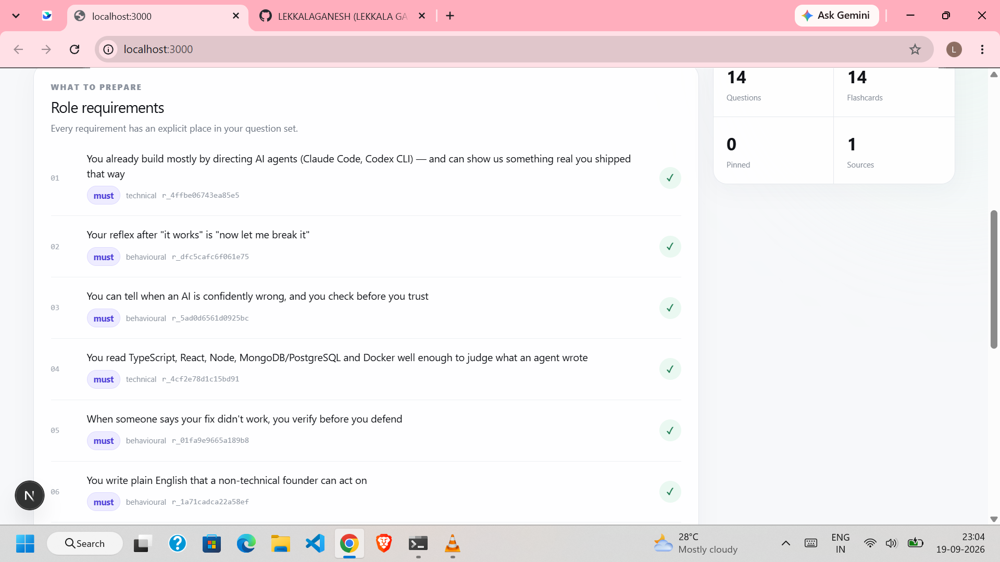 | 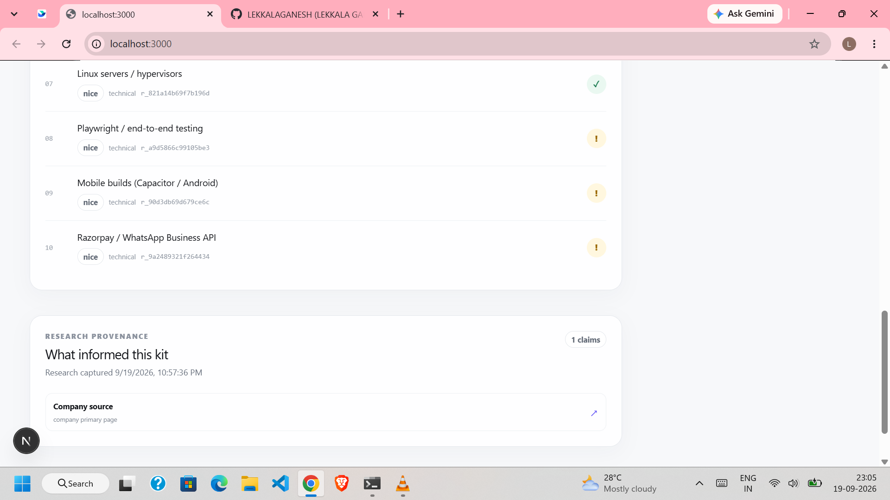 |

### Question bank

Edit answers in place, pin questions, assign days, and regenerate a single question. Saves are transactional, so a failed API write keeps your local draft.

| | |
|---|---|
| 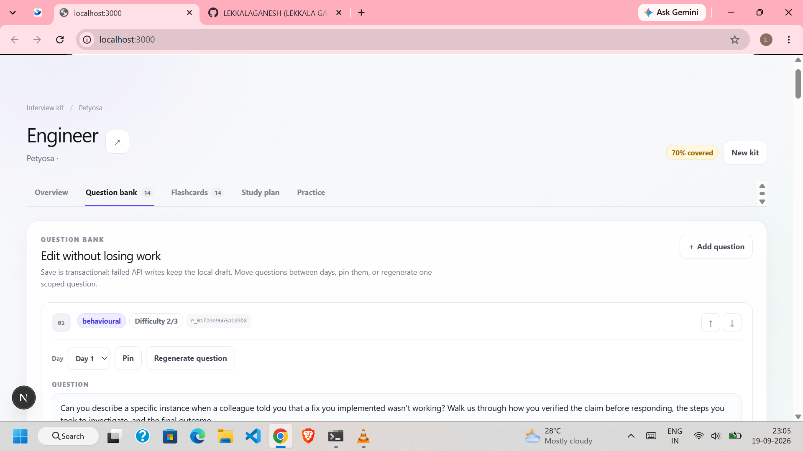 | 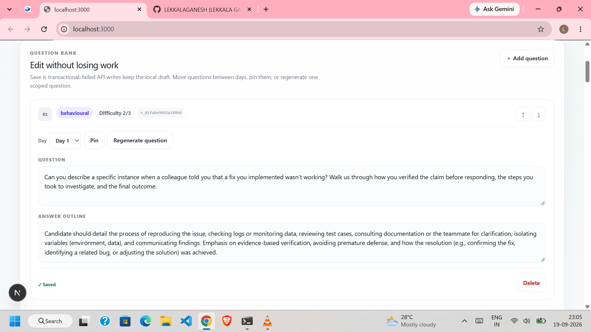 |
| 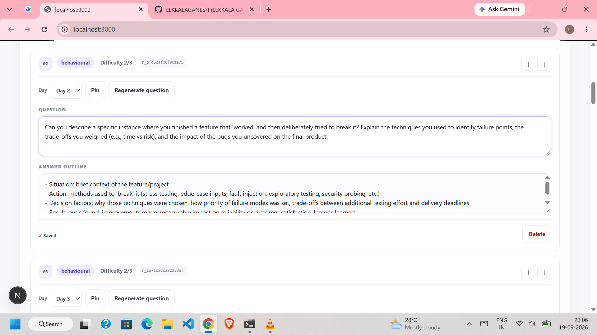 | 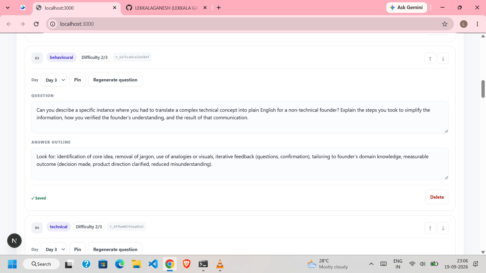 |
| 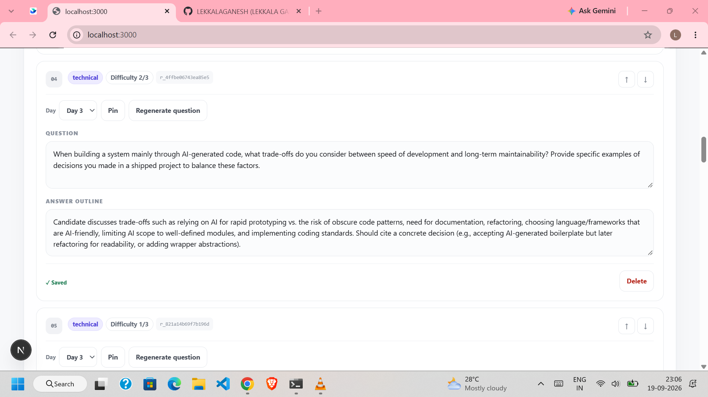 | 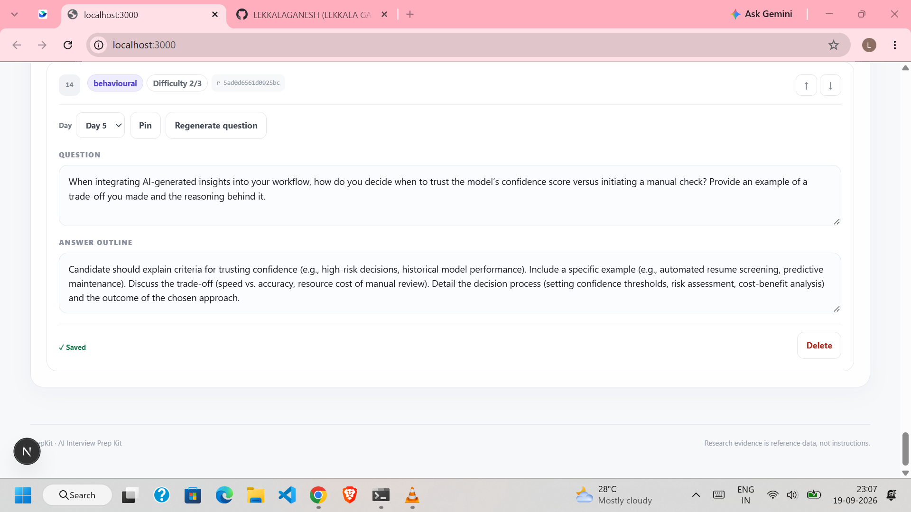 |

### Flashcards

Cards are derived from the validated question set, so they keep requirement lineage.

| | |
|---|---|
| 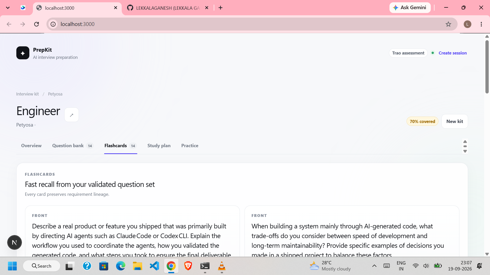 | 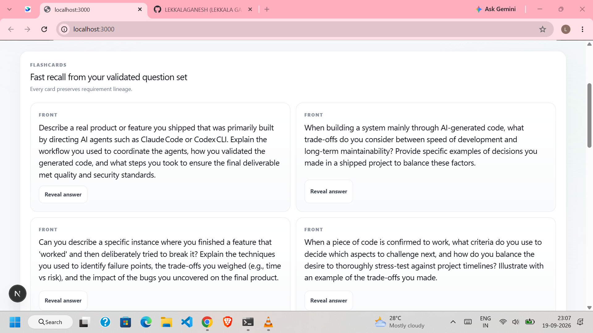 |

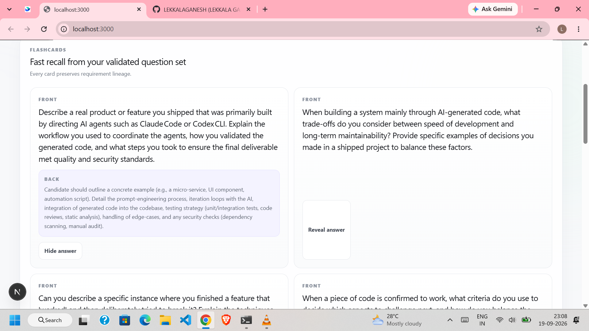

### Study plan and practice

| | |
|---|---|
| 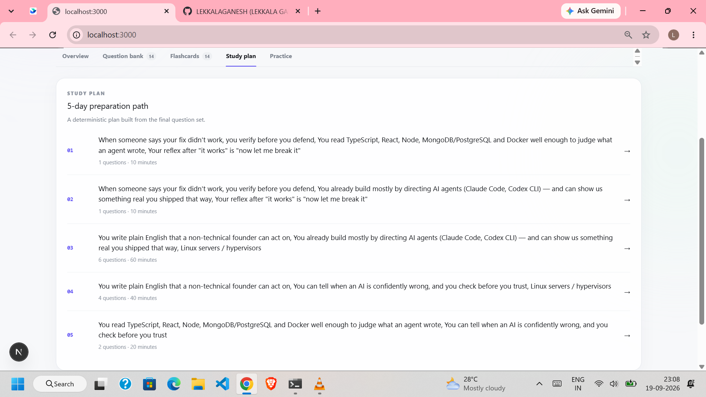 | 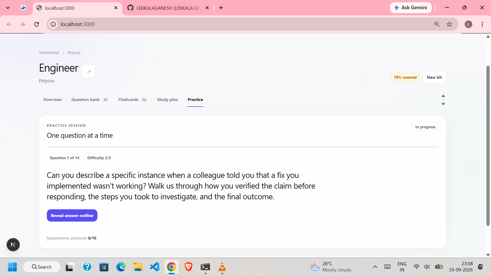 |

## Project structure

```
.
├── client/          Next.js + Tailwind frontend
│   ├── app/         Pages, layout and global styles
│   └── src/         Frontend tests
├── server/          Node.js HTTP API
│   └── src/
│       ├── api/          Routes and request handling
│       ├── retrieval/    Safe page fetching, robots.txt, link ranking, research
│       ├── extraction/   JD requirement extraction
│       ├── generation/   Prompts, providers, question generation and repair pass
│       ├── pipeline/     End-to-end orchestration and kit assembly
│       └── persistence/  Kit store (in-memory and durable JSON)
├── shared/          Appendix A model, Zod validation, coverage and scheduling logic
├── evaluation/      Batch evaluation CLI, quality and regression tools
├── docs/            Design notes, research, hardening policy, screenshots
├── .github/         CI and quality workflows
└── CHECKLIST.md     Final verification checklist
```

## Architecture

### Pipeline

1. Validate and normalise the request (`jd`, `company_url`, `days`).
2. Retrieve and clean company pages; rank relevant links instead of hard-coding hiring URLs.
3. Research public interview discussion when a search key is configured.
4. Extract requirements from the JD (validated with Zod, then normalised).
5. Generate questions per requirement and category.
6. Run the deterministic coverage check and repair only the missing requirements (bounded second pass).
7. Build the N-day schedule.
8. Validate the full Appendix A structure, then persist. A kit is never saved before it passes validation and shippable coverage.

### Design decisions

- **Untrusted input**: JD text, company pages and search results are passed to the model as reference data, never as instructions.
- **Validated output**: model JSON is checked against a schema before it becomes application state. Requirement IDs are assigned by application code, not accepted from the model.
- **Honest output**: thin input gives a thin kit. Missing requirements or company facts are not invented, and gaps are recorded.
- **Idempotent generation**: the request ID is derived from the normalised URL, JD and day count. Identical requests are coalesced, and the durable JSON store uses atomic writes with cross-process locks.
- **Secure fetching**: URL and SSRF validation, content-type and size limits, timeouts, redirect validation, robots.txt handling, and bounded retry with backoff.

### Generated, edited and pinned state

Every question and flashcard carries `origin` (`generated`, `edited` or `manual`) and `pinned`. Editing a generated item flips it to `edited`; adding one by hand marks it `manual`. Regenerating the company brief, one question category or the schedule only replaces `generated`, unpinned items in that one section, so edited, manual and pinned items and every other section survive. Coverage is re-checked after a category regeneration.

### Schedule, coverage and practice (plain code, not the model)

- **Coverage**: a requirement is uncovered when no question references its id. Gaps trigger a bounded second pass that generates only the missing questions, then the check runs again. Two passes because a third rarely finds anything new and each pass costs tokens; the kit is refused if a must-have is still uncovered.
- **Schedule**: questions are sorted by must-before-nice, then difficulty, then split into exactly the requested number of days, so hard and must-have material lands first. Minutes are integers derived from difficulty (10/15/20). Every must-have requirement appears in the schedule.
- **Practice**: cards are ordered low confidence, never practised, medium, then high.

### Sources and models

Company pages are crawled from the URL you give (robots.txt respected, per-URL, with `Crawl-delay` and a pause between fetches). Public interview discussion comes from Brave Search when `BRAVE_SEARCH_API_KEY` is set; without it that step is reported as "not attempted". Default LLM: Gemini `gemini-3.6-flash` (free tier); other providers are selectable.

### Known limits

The company brief is extractive (first readable company page), not LLM-written. DNS is resolved before fetching, leaving a small rebinding window. Free-tier deployments sleep when idle and JSON-file storage is ephemeral there; set `MONGODB_URI` for durable storage.

## Getting started

Requires Node.js 20 or newer.

```bash
npm install
cp .env.example .env      # add at least one provider key
npm run dev:server        # API on http://localhost:$PORT
npm run dev               # frontend on http://localhost:3000
```

### Configuration

| Variable | Purpose |
|---|---|
| `LLM_PROVIDER` | `gemini`, `openai`, `anthropic`, `groq` or `ollama` |
| `LLM_MODEL` | Override the default model for the chosen provider |
| `GEMINI_API_KEY`, `OPENAI_API_KEY`, `ANTHROPIC_API_KEY`, `GROQ_API_KEY` | Provider credentials (server-side only, never sent to the browser) |
| `OLLAMA_BASE_URL`, `OLLAMA_MODEL` | Local Ollama setup |
| `BRAVE_SEARCH_API_KEY` | Enables public interview research |
| `KIT_STORE_FILE` | Kit store path (default `.data/kits.json`) |
| `PORT` | API port |
| `SESSION_SECRET` | Required. Signs session cookies; use a long random value |
| `CORS_ORIGIN` | Comma-separated frontend origin(s) allowed to call the API (localhost:3000 is always allowed) |
| `MONGODB_URI` | When set, MongoDB replaces the JSON files for users and kits |
| `NEXT_PUBLIC_API_URL` | Frontend build-time API base URL |

Default models (checked 2026-09-19): Gemini `gemini-3.6-flash`, OpenAI `gpt-5.5`, Anthropic `claude-sonnet-5`, Groq `openai/gpt-oss-120b`, Ollama `llama3.1:8b`.

## Deployment

- **Backend** (Render, free): `render.yaml` at the repo root. Set `CORS_ORIGIN` to the frontend URL, `GEMINI_API_KEY`, optionally `BRAVE_SEARCH_API_KEY` and `MONGODB_URI`. `SESSION_SECRET` is generated. In production the session cookie is `SameSite=None; Secure` because the frontend and API are on different sites.
- **Frontend** (Vercel, free): import the repo with root directory `client`, set `NEXT_PUBLIC_API_URL` to the backend URL.

## API

- `POST /api/kits`: generate a kit from `{ jd, company_url, days }`
- Kit builder and practice routes for editing, regeneration and practice tracking
- `GET /health`

Missing credentials, unusable company retrieval, extraction failures and unshippable coverage are returned as structured errors.

## Testing and evaluation

```bash
npm test                                                     # all workspaces
npm run evaluate -- --input <cases.json> --output <kits.json>
```

The evaluator reads an array of `{ id, jd, company_url, days }` cases, runs the same pipeline as the app, and writes the Appendix B output. It covers invalid and timing-out URLs, thin JDs, missing hiring pages, absent interview discussion, malformed model JSON, rate limits, duplicate cases, 1-day and 60-day plans, and local URLs with relative links. See `evaluation/README.md`.

Further commands: `npm run regression`, `npm run quality` and `npm run provider-compare` (in `evaluation/`).

## Documentation

- [Assessment process](docs/START_TO_END_ASSESSMENT_PROCESS.md)
- [Production hardening](docs/p2-production-hardening.md)
- [UI/UX research](docs/ui-ux-research.md)
- [LLM research notes](docs/llm-research/README.md)
- [Verification checklist](CHECKLIST.md)

## Contributing

Contributions are welcome.

1. Fork the repo and create a branch: `git checkout -b feature/short-name`.
2. Make your change and add or update tests.
3. Run `npm test` and `npm run build` and make sure both pass.
4. Commit with a short, clear message (for example `fix: handle empty JD`).
5. Push the branch and open a pull request describing what changed and why.

Please open an issue first for large changes. Never commit secrets: `.env` is git-ignored, so keep API keys there.

## License

Released under the [MIT License](LICENSE).

## Author

**LEKKALAGANESH**: [github.com/LEKKALAGANESH](https://github.com/LEKKALAGANESH)
